# ☕ 키오스크 주문 시스템 (Flask + HTML)

## 📌 프로젝트 설명

카페 키오스크의 주문 과정을 시뮬레이션한 웹 애플리케이션입니다.  
수량 선택, 결제 확인, 다시 주문하는 기능을 제공합니다.

---

## ✅ 주요 기능

- 메뉴 수량 선택
- 결제 페이지 전환 및 주문 정보 표시
- 홈 버튼으로 재주문 가능
- Flask 기반 API 통신 (`/menu`, `/order`)

---

## 💡 구성 파일

| 파일명 | 설명 |
|--------|------|
| `index.html` | 사용자 인터페이스 (HTML + JS) |
| `kiosk_server.py` | Flask 백엔드 서버 |
| `README.md` | 전체 프로젝트 설명 및 평가 포함

---

## 🧾 시퀀스 다이어그램 (Mermaid)

```mermaid
sequenceDiagram
    participant Customer
    participant Kiosk
    participant Server

    Customer->>Kiosk: 메뉴 선택
    Kiosk-->>Customer: 선택한 메뉴 표시
    Customer->>Kiosk: 결제 요청
    Kiosk->>Server: 주문 정보 전송
    Server-->>Kiosk: 주문 접수 응답
    Kiosk-->>Customer: 주문 완료 안내
```



---

## 🧪 모듈 평가 결과

### 1. 응집도(Cohesion)
- Flask 서버는 `메뉴 조회`, `주문 처리`, `HTML 제공`이라는 기능에 집중되어 있음
- 각 함수는 단일 책임을 가지고 구조가 명확함
- HTML 파일은 UI와 입력 처리에만 집중되어 있음
- ✅ 결론: 높은 응집도 유지

### 2. 결합도(Coupling)
- 서버와 UI는 API(`/menu`, `/order`)를 통해 통신하여 느슨하게 결합됨
- 변경에도 서로 영향을 거의 주지 않음
- ✅ 결론: 낮은 결합도 유지

#### 📌 종합 평가 요약

| 항목 | 평가 |
|------|------|
| 응집도 | ✅ 높음 |
| 결합도 | ✅ 낮음 |
| 유지보수성 | ✅ 용이 |
| 확장성 | ✅ 좋음 |

---

## ⚙️ 실행 방법

1. Flask 설치
```bash
pip install flask
```

2. 서버 실행
```bash
python kiosk_server.py
```

3. 자동으로 브라우저가 열리며 키오스크 주문 시스템 실행됨
